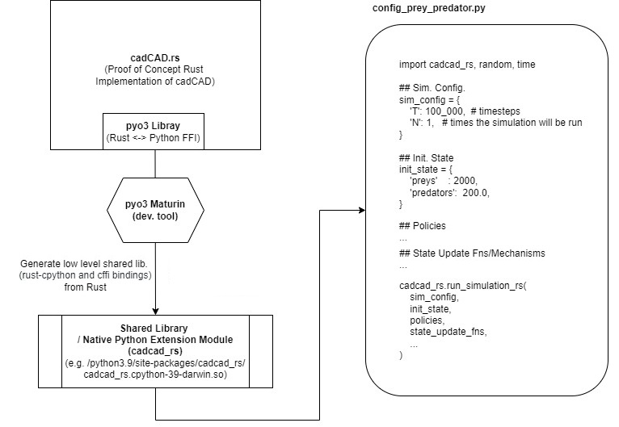

# cadcad-rust-poc
Proof of Concept Rust Implementation of cadCAD

## 1. General Info

<h1>
    
</h1>

- All user config. (sim_config, init_state,  policies, state_update_fns) defined in Python and passed to Rust  
- Python policies/state update fns are called back from Rust (Rust state object also passed to Python because of this)  
- All library code `src/lib.rs` (run simulation loop, Rust-Python FFI etc..) is in Rust  


#### Possible Next Actions:  
- Extend the State value type `enum Value` in `src/lib.rs` (see https://pyo3.rs/v0.15.1/conversions/tables.html#argument-types) to support more types between Rust-Python. Currently, only int32 and float64 types are supported.


## 2. How to experiment

Install
```
Install Rust: https://www.rust-lang.org/tools/install
git clone https://github.com/cadCAD-org/cadcad-rust-poc.git
pip install virtualenv
cd cadcad-rust-poc
virtualenv --python python3.9 venv
source venv/bin/activate // or 'deactivate' when needed
pip install maturin
```

Build and Run
```
cd cadcad-rust-poc
maturin develop && python3 config_prey_predator.py // debug build 
maturin develop --release && python3 config_prey_predator.py // release build
```

Shared lib. location:  
`<proj_root>/venv/lib/python3.9/site-packages/cadcad_rs/cadcad_rs.cpython-39-darwin.so`


## 3. Performance Tests

### A. Perf. comparisons of different implementations with cadCAD.rs

Comparing "the time to complete a simulation" with a sample user config. (preys_predators) used with different implementations:   

(Full user config. can be seen at the end)

| Implementation                   | Time to complete a simulation |
|----------------------------------|-------------------------------|
| 1. Everything in Rust <br/> &nbsp;&nbsp;&nbsp; (cadCAD.rs, this repo, used as app.)               | 92 ms                         |
| 2. Everything in Python <br /> &nbsp;&nbsp;&nbsp; (my very simple Python impl.)            | 285 ms                        |
| 3. cadCAD.rs as library (this repo) | 962 ms                        |
| 4. Using cadCAD python package      | 12 sec                        |

#### 1. Everything in Rust (cadCAD.rs, this repo, used as app.)
92ms  
- All user config. (sim_config, init_state, policies, state_update_fns) and library code (run simulation loop etc.. ) are in Rust  
- How to experiment: 

```
cd using_pure_rust
cargo r
```


#### 2. Everything in Python (my very simple Python impl.)
285ms  
- All user config. (sim_config, init_state,  policies, state_update_fns) and library code (run simulation loop etc.. ) are in Python  
- How to experiment: 

```
cd using_pure_python
python main.py
```

#### 3. cadCAD.rs as library (this repo)  
962ms  
- All user config. (sim_config, init_state,  policies, state_update_fns) defined in Python and passed to Rust  
- Python policies/state update fns are called back from Rust  
- All library code (run simulation loop etc.. ) is in Rust  


#### 4. Using cadCAD python package
12sec   
- https://github.com/cadCAD-org/cadCAD
- How to experiment: 

```
cd using_cadCad_py_pkg
python main.py
```

#### The user config. used for performance tests: 

All implementations above used this user config:   
(Note: Pure Rust impl. uses Rust version of this config).

```py
##
sim_config = {
    'T': 100_000,  # timesteps
    'N': 1,   # times the simulation will be run (Monte Carlo runs)
}

##
init_state = {
    'preys'    : 2000,
    'predators':  200.0,
}

## Params
MAX_PREYS = 3000

## Policies
def prey_change_normal_conditions(state):
    preys =  state['preys']
    # Assuming: preys_change goes down with every iteration since
    # natural resources limits the number of preys to MAX_PREYS 
    preys_change = random.randint(0, MAX_PREYS-preys) if preys < MAX_PREYS else 0
    return ( { "preys_change": preys_change } )

def predator_change_normal_conditions(state):
    return ( { "predators_change": random.uniform(-10.0, 10.0) } )

# SUFS/Mechanisms
def update_prey(s, _input):
    preys = s['preys'] + _input['preys_change']
    return ('preys', preys)

def update_predator(s, _input):
    predators = s['predators'] + _input['predators_change']
    return ('predators', predators) 
```   
    
Sample trajectory:		
```
{'preys': 2000, 'predators': 200.0}
{'preys': 2689, 'predators': 197.8061101157223}
{'preys': 2905, 'predators': 202.0033859231905}
{'preys': 2968, 'predators': 200.34499591706904}
{'preys': 2978, 'predators': 198.70585863272157}
{'preys': 2997, 'predators': 202.87972085498492}
{'preys': 3000, 'predators': 211.94531269176548}
{'preys': 3000, 'predators': 216.98291706699413}
{'preys': 3000, 'predators': 216.41763190811685} 
```

### B. Perf. compared - with and without pre-allocation:

**Summary:**    
Pre-allocated case is slightly faster in avarage  

Possible Next Actions: 
- Test with real life sized State object

State obj.:
```
INIT_STATE = [ 
    ("preys",     Foo { val: 2000, dummy_val: 0.1 } ),
    ("predators", Foo { val: 200 , dummy_val: 0.1 } )
]
```    

a) Final data and Trajectory vectors NOT pre-allocated:  

```
### Project: Example w/ struct value ...

---
 Starting simulation 0 ...
---
--- SIM_CONFIG: SimConfig { n_run: 3, timesteps: 500000 }
--- End of simulation 0
--- Elapsed time: 3.14s
--- Size of State obj.: 24
--- Size of traj. obj.: 12000024

---
 Starting simulation 1 ...
---
--- SIM_CONFIG: SimConfig { n_run: 3, timesteps: 500000 }
--- End of simulation 1
--- Elapsed time: 3.08s
--- Size of State obj.: 24
--- Size of traj. obj.: 12000024

---
 Starting simulation 2 ...
---
--- SIM_CONFIG: SimConfig { n_run: 3, timesteps: 500000 }
--- End of simulation 2
--- Elapsed time: 3.04s
--- Size of State obj.: 24
--- Size of traj. obj.: 12000024

----------------------END---------------------
```

b) Final data and Trajectory vectors pre-allocated:  

```
### Project: Example w/ struct value ...

---
 Starting simulation 0 ...
---
--- SIM_CONFIG: SimConfig { n_run: 3, timesteps: 500000 }
--- End of simulation 0
--- Elapsed time: 3.03s
--- Size of State obj.: 24
--- Size of traj. obj.: 12000024

---
 Starting simulation 1 ...
---
--- SIM_CONFIG: SimConfig { n_run: 3, timesteps: 500000 }
--- End of simulation 1
--- Elapsed time: 3.04s
--- Size of State obj.: 24
--- Size of traj. obj.: 12000024

---
 Starting simulation 2 ...
---
--- SIM_CONFIG: SimConfig { n_run: 3, timesteps: 500000 }
--- End of simulation 2
--- Elapsed time: 3.03s
--- Size of State obj.: 24
--- Size of traj. obj.: 12000024

----------------------END---------------------
```
### C. HashMap vs BTreeMap perf. test - with config_prey_predator_integer.rs:

**Summary:**   
For this example where we have small sized State object, using BTreeMap for State and Signal structs, we get the result with %38 less time compared to using HashMap.

Possible Next Actions: 
- Test with real life sized State object
- Try more efficient hash fns

```

//// State obj.
State::from([ ("preys", 2000), ("predators", 200), ] );

//// Tests

// Test 1 - Using "HashMap" for State and Signal structs

----------------------------------------------
### Project: Prey predators integer ...
---
 Starting simulation 0 ...
---
--- SIM_CONFIG: SimConfig { n_run: 2, timesteps: 1000000 }
--- End of simulation 0
--- Elapsed time: 8.07s
--- Size of State obj.: 48
--- Size of traj. obj.: 48000048
----------------------END---------------------

// Test 2 - Using "BTreeMap" for State and Signal structs

----------------------------------------------
### Project: Prey predators integer ...

---
 Starting simulation 0 ...
---
--- SIM_CONFIG: SimConfig { n_run: 2, timesteps: 1_000_000 }
--- End of simulation 0
--- Elapsed time: 5.15s
--- Size of State obj.: 24
--- Size of traj. obj.: 24_000_024
----------------------END---------------------
```
